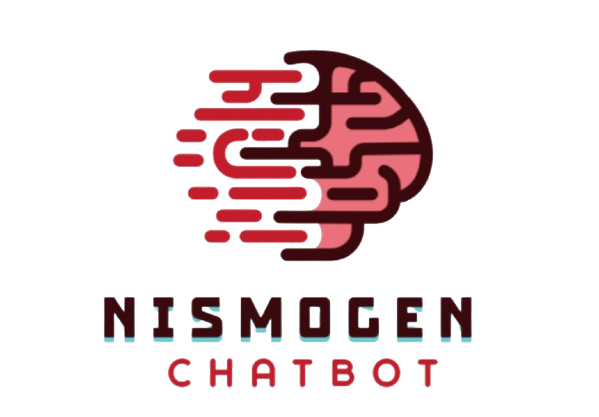

# NismoGen-Chatbot



## Table of Contents

- [Introduction](#introduction)
- [Features](#features)
- [Installation](#installation)
- [Usage](#usage)
- [Question Answering](#question-answering)
- [Text Summarization](#text-summarization)
- [Image Captioning](#image-captioning)
- [Audio Input and Output](#audio-input-and-output)
- [File Structure](#file-structure)
- [Technologies Used](#technologies-used)
- [Contributors](#contributors)


## Introduction

NismoGen-ChatBot is an advanced AI chatbot with multimodal capabilities, including text, audio, and image processing. It leverages state-of-the-art models for question answering, text summarization, and image captioning to provide accurate and insightful responses.

## Features

- **Question Answering**: Upload documents and ask questions based on the content.
- **Text Summarization**: Summarize long texts or documents.
- **Image Captioning**: Generate captions for uploaded images.
- **Audio Input and Output**: Record audio queries and listen to responses.

## Installation

To install and run the NismoGen-Chatbot, follow these steps:

1. **Clone the repository**:

    ```sh
    git clone https://github.com/youssefaymanmohamed/NismoGen-Chatbot.git
    cd NismoGen-Chatbot
    ```

2. **Create a virtual environment**:

    ```sh
    python -m venv venv
    source venv/bin/activate  # On Windows use `venv\Scripts\activate`
    ```

3. **Install the required dependencies**:

4. **Set up environment variables**:

    - Create a .env file in the Utils directory and add your API keys.

## Usage

To run the NismoGen-Chatbot, use the following command:

```sh
streamlit run chatbot_task.py
```

## Question Answering

- Upload documents (PDF, CSV, TXT).
- Select input method (Text or Audio).
- Ask questions based on the uploaded documents.

## Text Summarization

- Enter text or upload a document.
- Click "Summarize" to get a concise summary.

## Image Captioning

- Upload an image (JPG, JPEG, PNG).
- Get an AI-generated caption for the image.

## Audio Input and Output

- Record audio queries.
- Listen to AI-generated responses.

## File Structure

```
NismoGen-Chatbot/
├── Utils/
│   ├── audio_input.py
│   ├── audio_output.py
│   ├── Image_captioning.py
│   ├── question_answering_RAG.py
│   ├── summerization.py
│   ├── utils.py
│   ├── .env
├── documents/
│   ├── data.csv
│   ├── info.txt
│   ├── test_text.txt
├── chatbot_task.py
├── README.md
```

## Technologies Used

- Python: Main programming language.
- Streamlit: Web framework for creating the user interface.
- Transformers: Hugging Face library for NLP models.
- SpeechRecognition: Library for speech recognition.
- Pyttsx3: Text-to-speech conversion.

## Contributors

- **Youssef Ayman**: [GitHub](https://github.com/youssefaymanmohamed) | [Email](mailto:youssefaymanmohamed1@gmail.com)
- **Adham Ahmed**: [GitHub](https://github.com/adhamahmed46) | [Email](mailto:addham.taha@gmail.com)
